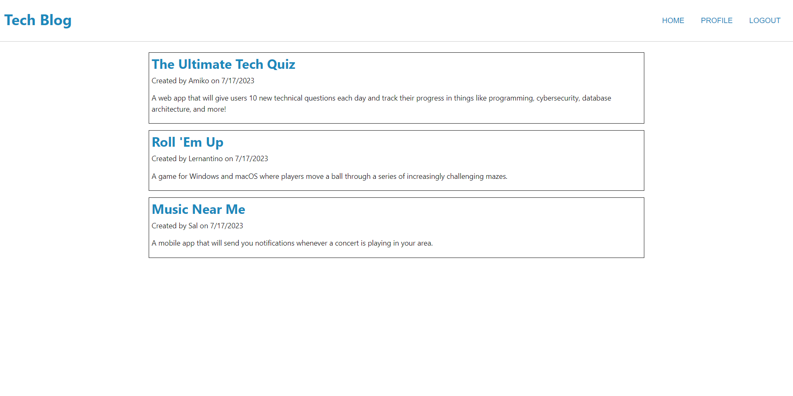

# Tech Blog

## User Story

```md
AS A developer who writes about tech
I WANT a CMS-style blog site
SO THAT I can publish articles, blog posts, and my thoughts and opinions
```

## Acceptance Criteria

```md
GIVEN a CMS-style blog site
WHEN I visit the site for the first time
THEN I am presented with the homepage, which includes existing blog posts if any have been posted; navigation links for the homepage and the dashboard; and the option to log in
WHEN I click on the homepage option
THEN I am taken to the homepage
WHEN I click on any other links in the navigation
THEN I am prompted to either sign up or sign in
WHEN I choose to sign up
THEN I am prompted to create a username and password
WHEN I click on the sign-up button
THEN my user credentials are saved and I am logged into the site
WHEN I revisit the site at a later time and choose to sign in
THEN I am prompted to enter my username and password
WHEN I am signed in to the site
THEN I see navigation links for the homepage, the dashboard, and the option to log out
WHEN I click on the homepage option in the navigation
THEN I am taken to the homepage and presented with existing blog posts that include the post title and the date created
WHEN I click on an existing blog post
THEN I am presented with the post title, contents, post creator’s username, and date created for that post and have the option to leave a comment
WHEN I enter a comment and click on the submit button while signed in
THEN the comment is saved and the post is updated to display the comment, the comment creator’s username, and the date created
WHEN I click on the dashboard option in the navigation
THEN I am taken to the dashboard and presented with any blog posts I have already created and the option to add a new blog post
WHEN I click on the button to add a new blog post
THEN I am prompted to enter both a title and contents for my blog post
WHEN I click on the button to create a new blog post
THEN the title and contents of my post are saved and I am taken back to an updated dashboard with my new blog post
WHEN I click on one of my existing posts in the dashboard
THEN I am able to delete or update my post and taken back to an updated dashboard
WHEN I click on the logout option in the navigation
THEN I am signed out of the site
WHEN I am idle on the site for more than a set time
THEN I am able to view posts and comments but I am prompted to log in again before I can add, update, or delete posts
```

## Description

This project consists in a Tech Blog that will allow us to either create our own post, Delete it, Update it, Check other posts and leave a comment on them. So this project helps in put all devs together in a blog so they can all make their own posts and comment on other peoples vlog. This project contains 1 SQL file, 6 handlebars files, 19 JavaScript files, 2 CSS files and 1 .env file.

The biggest challenge for me during this project was definitly not having an actual starter code and having to either do everything or repurpose everything. Another big issue i faced was going into issues and not being able to debug them since i was getting responde from it , and not getting any errors , so i ended up spending most of the time actually fixing issues and getting them to be fixed and work.

This challenge helped me a lot because it made my understanding of Handlebars much better and also made more confident while working with Heroku and displaying on it. There was a few more point in where this challenge helped me that i will be listing bellow

- Faster working with Handlebars
- Better understanding of JavaScript
- Higher Heroku understanding

## Table of Contents

- [Installation](#installation)
- [Usage](#usage)
- [Tests](#tests)
- [License](#license)
- [Questions](#questions)

## Installation

To install the necessary dependencies, run the following command:

```
npm i
```

## Usage

To use this repository is pretty easy. You will have to clone the repo , and when you clone it and open it, you will need to open your terminal and run the following command (npm i). After you runned this command you will need to login in your mysql by doing (mysql -u root -p) and then you will be asked to type your password. After typing your password and getting inside mysql you will need to run (source/db/schema.sql) and then type (quit;) to leave the mysql. After leaving the mysql you will need to run this following commands in your mysql (npm run seed) and after run (npm run start). After running this 2 commands you will be able to go to your localhost in the browser and use the blog. Or the easier way is to go to the deployed application  



Deployed Application: https://tech-blog-bootcamp-c686f3216563.herokuapp.com/

## Tests

I will be listing the tests i have done.

```
Tested - Able to Login
Tested - Able to Sign Up
Tested - Able to Create Post
Tested - Able to Delete Post
Tested - Able to Update Post
Tested - Able to View Other Posts
Tested - Able to Open Posts
Tested - Able to Comment on Posts
Tested - Able to Logout
```

## License


This project is licensed under the MIT license.

## Questions

For any questions or inquiries, feel free to reach out to me:

- GitHub: [DiogoS77](https://github.com/DiogoS77)
- Email: diogo.messi.18@hotmail.com

Deployed Application: https://tech-blog-bootcamp-c686f3216563.herokuapp.com/